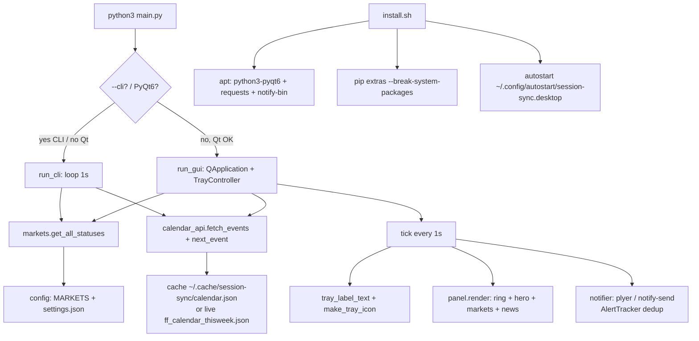

# CHANGES + Design Log — Session Sync

Tracking file for code changes, install fixes, and how the app works.

## Changelog

### v1.0.0 — 2026-09-19 — distributable release
- **Packaging**: proper `.deb` (`build-deb.sh`), one-line installer (`install.sh`),
  GitHub Actions release workflow (`.github/workflows/release.yml`).
  - installs to `/opt/session-sync`, launcher `/usr/bin/session-sync`
  - crash-resilient launcher (restarts up to 3×), detaches from terminals
  - `/etc/xdg/autostart/session-sync.desktop` → silent tray start at login
    for all users; per-user `Hidden=true` override for the in-app toggle
  - icons rendered to 8 PNG sizes + scalable SVG (`tools/render_icons.py`)
- **Auto-update** (`updater.py`): checks GitHub Releases (24 h cache), tray
  notification + one-click `pkexec apt-get install` + auto-relaunch.
- **Themes**: 5 + system — light, dark, dark_purple, mint_light, mint_dark;
  per-theme accent threaded through stylesheet + ring timer.
- **Fixes**: autostart no longer leaks `--hidden` into saved settings;
  `QCursor` imported at module level; dead imports removed; app logs to
  `~/.cache/session-sync/app.log` with 1 MB rotation; single-instance guard
  retries during updater relaunch; tray icon cached (no 1 s pixmap churn).
- **Install discovery**: an older copy of this app at
  `antigravity/code/trade_box/market-coundown&news` was auto-starting at login
  (leftover `~/.config/autostart/market-sync.desktop`) and running the old
  crash-prone build. Stale entry disabled; running instance stopped.

### v0.1.0 — 2026-09-18 — initial build
- `main.py` — entry: tray GUI (`run_gui`) + CLI fallback (`run_cli --cli --news --once`)
- `config.py` — 5 markets (SYDNEY, TOKYO, LONDON, NEW_YORK, NYSE), `settings.json` in `~/.config/session-sync/`
- `markets.py` — stdlib-only DST engine (`zoneinfo`), NYSE holidays + half-days, countdown + progress
- `calendar_api.py` — ForexFactory feed (`ff_calendar_thisweek.json`), `~/.cache/session-sync/` TTL 15 min, impact filter
- `ui.py` — PyQt6 tray (text icon `SYM HH:MM:SS`) + 344px panel (ring, hero, markets, news, footer)
- `notifier.py` — `plyer` → `notify-send` fallback, `AlertTracker` dedup
- `install.sh` + `autostart/session-sync.desktop` + `requirements.txt` + `README.md`

### 2026-09-18 — install investigation (from `new-session---2026-09-18t02-39-03-913z.json`)
Found failures:
1. `chmod: cannot access 'install.sh'` + `can't open file '/home/aabir/main.py'`
   - Cause: ran from `~` instead of project dir, plus pasted `chmod +x install.sh./install.sh` as one line.
   - Fix: `cd "/media/.../market-coundown&news"` (quotes needed — `&` in path), then run each line separately.
2. `pip install --user -r requirements.txt` → `error: externally-managed-environment` (PEP 668, Mint 22.3 / Python 3.12)
   - Core app unaffected: `python3-pyqt6`, `python3-requests`, `notify-send` come from `apt`.
   - Fix: `pip3 install --user --break-system-packages -r requirements.txt` or skip pip entirely.
3. Verified on this box: `Qt OK`, `requests 2.31.0`, `notify-send` present, `python3 main.py --cli --once --news` prints live countdowns.

## Design — how it works

Modules: `config` (defs + settings) → `markets` (time engine) + `calendar_api` (news) → `main` (CLI/GUI router) → `ui` (tray+panel) → `notifier` (alerts).

Settings: `~/.config/session-sync/settings.json` — `selected_market`, `time_mode`, `currencies`, `min_impact`, `alerts_enabled`, `alert_minutes_before`, `news_refresh_minutes`, `theme`, `show_*`.
Cache: `~/.cache/session-sync/calendar.json`.

Market engine (`markets.py`):
- Local open/close per market in IANA tz (`Australia/Sydney 07:00-16:00`, `Asia/Tokyo 09:00-18:00`, `Europe/London 08:00-16:30`, `America/New_York 08:00-17:00 FX`, `NYSE 09:30-16:00`).
- `market_status()`: if trading day + inside bounds → `OPEN / closes`; if before open → `CLOSED / opens today`; else scan forward up to 10 days (skips Sat/Sun + NYSE holidays).
- NYSE holidays computed locally: New Year, MLK, Presidents, Good Friday (via Easter), Memorial, Juneteenth, July 4, Labor, Thanksgiving, Christmas + observed-shift + half-days (day after Thanksgiving, Jul 3, Dec 24 → 13:00 close).

News (`calendar_api.py`): `fetch_events()` → fresh cache (<15 min) ? return : `GET ff_calendar_thisweek.json` → normalize → sort → cache. Never raises; returns `(events, from_cache, note)`. `filter_events()` drops >2h old, >72h ahead (7d for next), currency + impact rank filter. `next_event()` = first upcoming.

UI loop (`ui.py:TrayController.tick`, 1 s `QTimer`):
1. `now_utc = now(timezone.utc)`
2. `statuses = get_all_statuses(now_utc)`, pick `selected`
3. `nxt = next_event(...)`
4. Tray icon = rendered text (`tray_label_text`: symbol + countdown + local time + `• CCY 45m`) + green/grey dot; tooltip = state + clocks + next event
5. If panel visible → `panel.render(...)` (hero ring + countdown, markets rows, NEXT card + 8 news rows, NYSE-holiday footer)
6. `_maybe_alert()` → market pre-alert (≤5 min, once per key) + high-impact news (≤15 min, once per id)

CLI (`main.py:run_cli`): same engine, prints all 5 markets each second, `Ctrl+C` to quit.



## File map

```
main.py          entry (tray + --cli fallback + --hidden + --check-update)
config.py        market defs + settings + install/autostart paths + repo constants
markets.py       DST-aware engine + NYSE holidays (stdlib only)
calendar_api.py  ForexFactory feed + ~/.cache/session-sync cache
ui.py            PyQt6 tray + panel + 6 themes + update UI
updater.py       GitHub release check + deb download + pkexec install
notifier.py      notify-send / plyer alerts
install.sh       one-line installer (curl | sudo bash) → latest GitHub release
build-deb.sh     one-command .deb build (stages in /tmp, POSIX fs safe)
packaging/       DEBIAN/control + postinst + postrm, launcher, desktop files
tools/           render_icons.py (PNG icon set for the .deb)
requirements.txt PyQt6 + requests + plyer
assets/icon.svg  app icon
autostart/       dev-only Cinnamon autostart template
.github/         release workflow (tag v* → build .deb → publish release)
```
