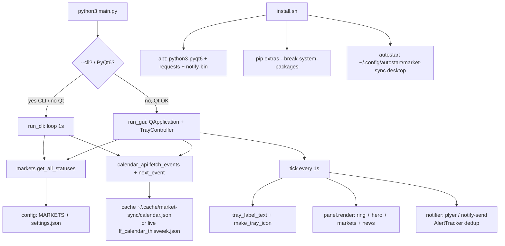

# CHANGES + Design Log — Market Sync

Tracking file for code changes, install fixes, and how the app works.

## Changelog

### v1.4.0 — 2026-09-19 — Design System v2.0 + Cinnamon applet (both-in-one)
Implements `System_Design/DESIGN_SYSTEM.md` (spec v2.0.0):
- **Panel shell fixed** — the glass window is now a `QFrame#PanelRoot` inside a
  transparent host (a bare custom QWidget silently skipped QSS backgrounds,
  which is why the old renders showed floating cards with no frame)
- **v2.0 tokens**: rgba window/card/active/hover/divider/input surfaces,
  slate text scale, spec impact capsules (dark + light variants), new
  currency palette, Inter font stack with system fallbacks
- Window: 410px, radius 14, `Tool + Frameless + StaysOnTop`, translucent
- Cards: 82px, 26px landmark badge, 13px names, 22px signed countdowns,
  20px progress rings (neon arc when open, faint track when closed)
- Brand bar (32px): new twin-arc brand logo, MARKET SYNC, drawer toggle,
  🔔 alerts, ⚙️ preferences, ✕ hide; Up Next drawer with date bar + `▴`
- **Cinnamon applet** (`market-sync@cinnamon`): live Pango `● LON +04:05`
  sessions from `panel_status.json`, left-click opens the *same* glass panel,
  right-click menu (Toggle / Preferences… / Quit), both-in-one tray icon
- **IPC**: `QLocalServer` (`market_sync_ipc`) + `market-sync --toggle/--show/
  --hide/--preferences/--quit` (applet drives the running instance)
- `install-applet.sh` — installs/restores the applet on the Cinnamon panel
  (and `--remove`), no hardcoded paths
- Preferences (380px): live top-panel preview, Layout / Show-time-as / Format
  / Panel Sessions segments, "Show standalone tray icon alongside panel
  applet" (both-in-one, default on), market routing table, updates, footer
- **Dependency fix**: added `python3-pyqt6.qtsvg` — apt's python3-pyqt6 does
  not ship QtSvg, which made landmark badges fall back to letters on fresh
  installs
- Fixed `QColor("rgba(..., 0.9)")` float-alpha parsing (rendered black)
- News cache renamed to `news_events.json` (legacy `calendar.json` still read)
- New README screenshots incl. applet strip; GitHub repo description/topics
  refreshed (no stale applet-only metadata)

### v1.3.2 — 2026-09-19 — v0.2 settings collision fix
- The retired v0.2 app shared `~/.config/market-sync/settings.json`. Its
  defaults (e.g. NYSE `"none"`, `start_hidden: true`) leaked into the new
  app and could hide market cards. Now detected, translated and backed up:
  - `"+ menu bar"` → `panel`, `"none"` → `popup` (card shows, tray loop off)
  - `menu_layout` → `tray_layout`, `show_time_as` → `tray_time_as`,
    `panel_session_filter` → `tray_sessions`
  - `start_hidden` reset (never inherit silent start from the old app)
  - old-only keys dropped; original file kept as `settings.json.v0.2-backup`
- The cleaned settings are rewritten in the new format on first load

### v1.3.1 — 2026-09-19 — v0.2 Preferences dialog
- Rebuilt ⚙️ Preferences to mirror the old v0.2 window:
  - **Live tray preview** strip (updates as you change options)
  - Segmented controls: **Layout** (Compact Symbols / Standard Names),
    **Show Time As** (Local Time / Countdown), **Format** (12h / 24h),
    **Tray Sessions** (Active Only / Active + Next / All), Tray icon
    (Text / Logo + dot)
  - **Market List** routing per market: **None** (hide card) /
    **Popup** (panel only) / **+ Tray** (also in tray loop)
  - News (impacts, currencies, refresh, alerts), Window & Startup
    (theme, default market, drawer, auto-hide, left-click, autostart,
    start hidden), Updates (check + install), footer with version/author
    and the red Quit app button
- Panel grid now rebuilds on routing changes (hidden cards collapse the grid)
- Tray text builder respects layout / time-as / sessions / routing
- Settings: `market_display`, `tray_layout`, `tray_time_as`, `tray_sessions`;
  migration from `market_loop` (True → + Tray, False → Popup)
- README: preferences screenshot added to docs/screenshots

### v1.3.0 — 2026-09-19 — full v0.2 layout parity
Structure now matches Market Sync v0.2, not just the skin:
- **Panel**: market card grid (2 columns, 88px v0.2 cards with landmark,
  full name, market-local clock, signed countdown, pill, mini ring) →
  brand bar → collapsible **Up Next drawer**. The big hero banner is gone.
- **Brand bar**: logo + MARKET SYNC + 🌙 theme + 🔔 alerts toggle +
  ⚙️ Preferences + ✕ hide
- **Up Next drawer**: 34px trigger bar ("12m To next event (🔴 USD …) ∧"),
  expands to chips + news rows + date bar "18 Sep • 💻 14:32" with collapse
  control; laptop clock lives in the date bar
- **News rows**: relative time (12m / 5h 42m / 2d 3h), impact pill
  (HIG/MED/LOW, v0.2 red/orange/yellow), colored currency pill, title
- **Impact chips are multi-select** like v0.2: [All] [🔴 High] [🟠 Med]
  [🟡 Low]; holidays appear when all three are ticked
- **Tray**: multi-market text `● LON +02:14  ○ NYC -05:02` (open + next,
  bright/dim, per-market loop toggles) or single-market mode; icon style
  text or v0.2 logo + status dot
- **Preferences window** (460×620): appearance, 12/24h clock, tray options,
  markets & loop, news impacts/currencies/refresh, behaviour, startup,
  updates (check + install), quit
- **Market order/name**: London, New York, Sydney, Tokyo, NYSE; "New York"
- Settings migrations: `min_impact` → `active_impacts`; new keys validated
- Panel sizes: 410×364 collapsed / 410×536 expanded (fits 768p)
- Kept stability features: auto-hide on focus loss, ✕ close, silent login
  start, one-click updates, single instance, crash-restart launcher

### v1.2.0 — 2026-09-19 — v0.2 glass design port
The standalone app now wears the original Market Sync v0.2 design language:
- **Glassmorphism**: translucent frosted panel + cards (pure rgba translucency —
  no blur/shadow effects, so it stays crash-safe on Cinnamon)
- **Landmark vector badges**: London Eye, Statue of Liberty, Sydney Opera
  House, Torii Gate (SVGs from v0.2, rendered via QtSvg) on cards, hero, and
  tray menu icons
- **Market cards**: 2-column glass grid — top row landmark + symbol + local
  clock, bottom row signed countdown (+open / −closed) + OPEN/CLOSED pill +
  mini progress ring; click a card to select that market
- **Active-session brightening**: open sessions glow neon green, closed ones
  dim to muted slate; card borders follow open/closed state
- **Signed countdowns**: tray shows `LON +02:14:33`, cards show `+ 05:18`
- **Impact chips**: [All] [🟡 Low] [🟠 Med] [🔴 High] — All includes holidays;
  Low/Med/High hide them (old v0.2 yellow/orange/red palette)
- **Brand bar**: logo + letter-spaced MARKET SYNC title, v0.2 style
- System theme now resolves light/dark properly (fallback dark, like v0.2)
- London symbol LDN → LON (v0.2 parity); panel slimmed to ~670px for 768p
- All v1.1 features kept: auto-update, autostart toggle, 6 themes, quit,
  auto-hide, single instance

### v1.1.0 — 2026-09-19 — renamed to Market Sync
- Full rename to match the repository: app name "Session Sync" → **Market Sync**;
  package, launcher and paths `session-sync` → `market-sync`
  (`/opt/market-sync`, `/usr/bin/market-sync`, `~/.config/market-sync`,
  `~/.cache/market-sync`, `market-sync.desktop` entries, icon file names).
- Settings auto-migrate from `~/.config/session-sync/settings.json` on first run.
- Note: v1.0.0 was published under the old name. If that .deb is installed,
  remove it once with `sudo apt remove session-sync` before installing 1.1.0.

### v1.0.0 — 2026-09-19 — distributable release
- **Packaging**: proper `.deb` (`build-deb.sh`), one-line installer (`install.sh`),
  GitHub Actions release workflow (`.github/workflows/release.yml`).
  - installs to `/opt/market-sync`, launcher `/usr/bin/market-sync`
  - crash-resilient launcher (restarts up to 3×), detaches from terminals
  - `/etc/xdg/autostart/market-sync.desktop` → silent tray start at login
    for all users; per-user `Hidden=true` override for the in-app toggle
  - icons rendered to 8 PNG sizes + scalable SVG (`tools/render_icons.py`)
- **Auto-update** (`updater.py`): checks GitHub Releases (24 h cache), tray
  notification + one-click `pkexec apt-get install` + auto-relaunch.
- **Themes**: 5 + system — light, dark, dark_purple, mint_light, mint_dark;
  per-theme accent threaded through stylesheet + ring timer.
- **Fixes**: autostart no longer leaks `--hidden` into saved settings;
  `QCursor` imported at module level; dead imports removed; app logs to
  `~/.cache/market-sync/app.log` with 1 MB rotation; single-instance guard
  retries during updater relaunch; tray icon cached (no 1 s pixmap churn).
- **Install discovery**: an older copy of this app at
  `antigravity/code/trade_box/market-coundown&news` was auto-starting at login
  (leftover `~/.config/autostart/market-sync.desktop`) and running the old
  crash-prone build. Stale entry disabled; running instance stopped.

### v0.1.0 — 2026-09-18 — initial build
- `main.py` — entry: tray GUI (`run_gui`) + CLI fallback (`run_cli --cli --news --once`)
- `config.py` — 5 markets (SYDNEY, TOKYO, LONDON, NEW_YORK, NYSE), `settings.json` in `~/.config/market-sync/`
- `markets.py` — stdlib-only DST engine (`zoneinfo`), NYSE holidays + half-days, countdown + progress
- `calendar_api.py` — ForexFactory feed (`ff_calendar_thisweek.json`), `~/.cache/market-sync/` TTL 15 min, impact filter
- `ui.py` — PyQt6 tray (text icon `SYM HH:MM:SS`) + 344px panel (ring, hero, markets, news, footer)
- `notifier.py` — `plyer` → `notify-send` fallback, `AlertTracker` dedup
- `install.sh` + `autostart/market-sync.desktop` + `requirements.txt` + `README.md`

### 2026-09-18 — install investigation (from `new-session---2026-09-18t02-39-03-913z.json`)
Found failures:
1. `chmod: cannot access 'install.sh'` + `can't open file '/home/aabir/main.py'`
   - Cause: ran from `~` instead of project dir, plus pasted `chmod +x install.sh./install.sh` as one line.
   - Fix: `cd "/media/.../market-coundown&news"` (quotes needed — `&` in path), then run each line separately.
2. `pip install --user -r requirements.txt` → `error: externally-managed-environment` (PEP 668, Mint 22.3 / Python 3.12)
   - Core app unaffected: `python3-pyqt6`, `python3-requests`, `notify-send` come from `apt`.
   - Fix: `pip3 install --user --break-system-packages -r requirements.txt` or skip pip entirely.
3. Verified on this box: `Qt OK`, `requests 2.31.0`, `notify-send` present, `python3 main.py --cli --once --news` prints live countdowns.

## Design — how it works

Modules: `config` (defs + settings) → `markets` (time engine) + `calendar_api` (news) → `main` (CLI/GUI router) → `ui` (tray+panel) → `notifier` (alerts).

Settings: `~/.config/market-sync/settings.json` — `selected_market`, `time_mode`, `currencies`, `min_impact`, `alerts_enabled`, `alert_minutes_before`, `news_refresh_minutes`, `theme`, `show_*`.
Cache: `~/.cache/market-sync/calendar.json`.

Market engine (`markets.py`):
- Local open/close per market in IANA tz (`Australia/Sydney 07:00-16:00`, `Asia/Tokyo 09:00-18:00`, `Europe/London 08:00-16:30`, `America/New_York 08:00-17:00 FX`, `NYSE 09:30-16:00`).
- `market_status()`: if trading day + inside bounds → `OPEN / closes`; if before open → `CLOSED / opens today`; else scan forward up to 10 days (skips Sat/Sun + NYSE holidays).
- NYSE holidays computed locally: New Year, MLK, Presidents, Good Friday (via Easter), Memorial, Juneteenth, July 4, Labor, Thanksgiving, Christmas + observed-shift + half-days (day after Thanksgiving, Jul 3, Dec 24 → 13:00 close).

News (`calendar_api.py`): `fetch_events()` → fresh cache (<15 min) ? return : `GET ff_calendar_thisweek.json` → normalize → sort → cache. Never raises; returns `(events, from_cache, note)`. `filter_events()` drops >2h old, >72h ahead (7d for next), currency + impact rank filter. `next_event()` = first upcoming.

UI loop (`ui.py:TrayController.tick`, 1 s `QTimer`):
1. `now_utc = now(timezone.utc)`
2. `statuses = get_all_statuses(now_utc)`, pick `selected`
3. `nxt = next_event(...)`
4. Tray icon = rendered text (`tray_label_text`: symbol + countdown + local time + `• CCY 45m`) + green/grey dot; tooltip = state + clocks + next event
5. If panel visible → `panel.render(...)` (hero ring + countdown, markets rows, NEXT card + 8 news rows, NYSE-holiday footer)
6. `_maybe_alert()` → market pre-alert (≤5 min, once per key) + high-impact news (≤15 min, once per id)

CLI (`main.py:run_cli`): same engine, prints all 5 markets each second, `Ctrl+C` to quit.



## File map

```
main.py          entry (tray + --cli fallback + --hidden + --check-update)
config.py        market defs + settings + install/autostart paths + repo constants
markets.py       DST-aware engine + NYSE holidays (stdlib only)
calendar_api.py  ForexFactory feed + ~/.cache/market-sync cache
ui.py            PyQt6 tray + panel + 6 themes + update UI
updater.py       GitHub release check + deb download + pkexec install
notifier.py      notify-send / plyer alerts
install.sh       one-line installer (curl | sudo bash) → latest GitHub release
build-deb.sh     one-command .deb build (stages in /tmp, POSIX fs safe)
packaging/       DEBIAN/control + postinst + postrm, launcher, desktop files
tools/           render_icons.py (PNG icon set for the .deb)
requirements.txt PyQt6 + requests + plyer
assets/icon.svg  app icon
autostart/       dev-only Cinnamon autostart template
.github/         release workflow (tag v* → build .deb → publish release)
```
