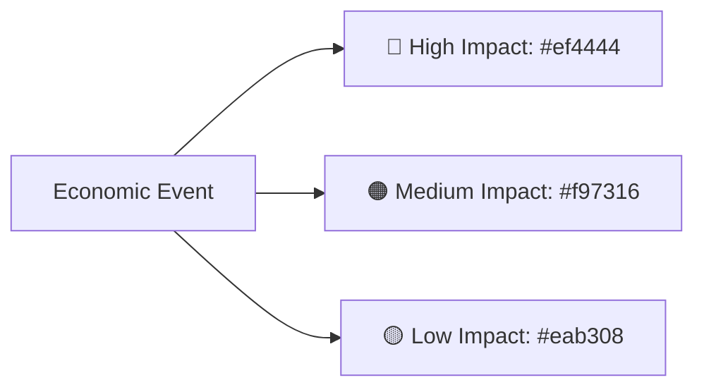

# Market Sync — Complete Design System & Architecture Specification

**Project**: Market Sync (`market-sync`)  
**Current Version**: `v1.3.2` (Design Language `v0.2` & `v2.0` Glass Parity)  
**Developer**: **Mahabub H. Aabir** (`maha_bub@outlook.com`)  
**Official Repository**: [https://github.com/mahabubaabir/market-sync](https://github.com/mahabubaabir/market-sync)  
**Target Environments**: Linux Mint 21/22+ (Cinnamon 5.x/6.x), Ubuntu 22.04/24.04+ (Cinnamon/GNOME/XFCE)  
**License**: MIT  

---

## 1. Executive Summary & Design Philosophy

**Market Sync** is a desktop trading companion designed to bring the elegance of macOS menu-bar trading countdowns to Linux desktops.

### Core Visual Principles
1. **Material UI Frosted Glass (Glassmorphism)**: Translucent, frosted background surfaces (`rgba(...)`) that harmoniously blend with the user’s personal desktop wallpaper.
2. **Neon Active Highlights**: Open, active trading hubs illuminate with a vivid neon-green glow (`#30d158`), high-contrast badge rings, and border accents.
3. **Muted Off-State Legibility**: Closed or off-session hubs use crisp, readable silvery-white slate (`#cbd5e1`) instead of overly dark or illegible tones.
4. **Minimal Panel Footprint**: Saves over 60% of top bar horizontal space by using 3-letter symbols (`LON`, `NYC`, `SYD`, `TYO`), tight formatting (`+04:05`), and smart session filters (`Active + Next`).
5. **All-in-One Unified Top Panel Integration**: The Cinnamon applet houses the **App Logo**, the **Live Countdown**, **Left-Click to Open Panel**, and **Right-Click for App Menu** in one single widget, automatically hiding duplicate tray icons.

---

## 2. Color Palette & Design Tokens

### 2.1 Dark Glass Theme (Default)

| Token Name | Hex / RGBA | Usage |
| :--- | :--- | :--- |
| `--window-bg` | `rgba(16, 20, 30, 0.88)` | Main dropdown container background |
| `--window-border` | `1px solid rgba(255, 255, 255, 0.08)` | Outer window glass border |
| `--card-bg-default` | `rgba(28, 34, 48, 0.70)` | Inactive/closed market card background |
| `--card-bg-active` | `rgba(20, 42, 30, 0.65)` | Active open market card background |
| `--card-border-default` | `1px solid rgba(255, 255, 255, 0.06)` | Inactive card border |
| `--card-border-active` | `1.5px solid #30d158` | Active open market illuminated border |
| `--card-border-hover` | `1px solid rgba(255, 255, 255, 0.16)` | Card mouse hover outline |
| `--text-primary` | `#f1f5f9` (Slate 100) | Main titles, numbers, large countdowns |
| `--text-secondary` | `#94a3b8` (Slate 400) | Subtitles, local clocks, labels |
| `--text-muted` | `#64748b` (Slate 500) | Secondary hints and disabled elements |
| `--accent-green` | `#30d158` | Open market status, active dot, progress arc |
| `--accent-cyan` | `#38bdf8` | Brand accent, filter highlight, link hover |
| `--panel-closed-text` | `#cbd5e1` | Closed sessions in top bar (crisp slate) |
| `--divider` | `rgba(255, 255, 255, 0.08)` | Section dividing lines |

### 2.2 Light Glass Theme

| Token Name | Hex / RGBA | Usage |
| :--- | :--- | :--- |
| `--window-bg-light` | `rgba(250, 252, 255, 0.88)` | Light mode window background |
| `--window-border-light`| `1px solid rgba(0, 0, 0, 0.08)` | Light mode outer glass border |
| `--card-bg-light` | `rgba(255, 255, 255, 0.85)` | Inactive market card background |
| `--card-active-light` | `rgba(236, 253, 245, 0.90)` | Active open market card background |
| `--card-border-active`| `1.5px solid #16a34a` | Emerald active card border |
| `--text-primary-light` | `#0f172a` (Slate 900) | High-contrast dark typography |
| `--text-sec-light` | `#475569` (Slate 600) | Secondary light mode typography |

---

## 3. Economic News Multi-Impact Engine

Economic news events are categorized into 3 standardized impact levels, each styled with dedicated semi-transparent backgrounds and borders for instant scannability:



### Impact Color Specifications

| Impact Level | Accent Hex | Dark Mode Background | Dark Mode Border | Pill Text |
| :--- | :---: | :--- | :--- | :---: |
| 🔴 **High** | `#ef4444` | `rgba(239, 68, 68, 0.18)` | `1px solid rgba(239, 68, 68, 0.40)` | `HIGH` |
| 🟠 **Medium** | `#f97316` | `rgba(249, 115, 22, 0.18)` | `1px solid rgba(249, 115, 22, 0.40)` | `MED` |
| 🟡 **Low** | `#eab308` | `rgba(234, 179, 8, 0.18)` | `1px solid rgba(234, 179, 8, 0.40)` | `LOW` |

### Interactive Multi-Select Filter Chips
In the "Up Next" news drawer header, users can toggle any combination of impact chips:
- `[All]`: Toggles all levels simultaneously.
- `[🔴 High]`: Shows/hides High Impact market-moving announcements.
- `[🟠 Med]`: Shows/hides Medium Impact reports.
- `[🟡 Low]`: Shows/hides Low Impact economic releases.

---

## 4. Landmark Vector Badges

Each financial hub is represented by a dedicated vector landmark icon rendered inside a circular badge with that hub's signature color glow:

```
┌─────────────┬─────────────┐
│  🎡 London  │  🗽 New York │
│  +04:05     │  -00:35     │
├─────────────┼─────────────┤
│  ⛵ Sydney  │  ⛩️  Tokyo   │
│  -57:35     │  -60:35     │
└─────────────┴─────────────┘
```

1. 🇬🇧 **London (LON)**: **London Eye** (`assets/london.svg`)
   - *Design*: Elegant rotating Ferris wheel rim, observation passenger pods, and radial suspension spokes. Accent: `#8ecd76`.
2. 🇺🇸 **New York (NYC)**: **Statue of Liberty** (`assets/new_york.svg`)
   - *Design*: Ascending beacon torch flame, crown rays, and stylized draped pedestal robe. Accent: `#c792ea`.
3. 🇦🇺 **Sydney (SYD)**: **Sydney Opera House** (`assets/sydney.svg`)
   - *Design*: Iconic expressionist interlocking shell roofs soaring over water waves. Accent: `#4da3ff`.
4. 🇯🇵 **Tokyo (TYO)**: **Torii Gate** (`assets/tokyo.svg`)
   - *Design*: Sacred Shinto gateway with curved kasagi top lintel, nuki tie-beam, and dual round pillars. Accent: `#ff6b6b`.

---

## 5. Brand Identity & Minimal Logo

The official Market Sync emblem represents global financial liquidity and time synchronicity.

```
         ▲
       /   \       Upper Arc: Cyan -> Indigo (#38bdf8 to #6366f1)
     │       │
     │   ●   │     Core: Glowing Convergence Center (fill #ffffff, glow #38bdf8)
     │       │
       \   /       Lower Arc: Emerald -> Cyan (#10b981 to #06b6d4)
         ▼
```

### SVG Path Structure (`assets/logo.svg`)
- **Upper Arc**: `M 50,14 A 36,36 0 0,1 86,50 A 36,36 0 0,1 77.5,73.5 L 68,64 A 24,24 0 0,0 74,50 A 24,24 0 0,0 50,26 L 50,36 L 32,20 L 50,4 Z`
- **Lower Arc**: `M 50,86 A 36,36 0 0,1 14,50 A 36,36 0 0,1 22.5,26.5 L 32,36 A 24,24 0 0,0 26,50 A 24,24 0 0,0 50,74 L 50,64 L 68,80 L 50,96 Z`
- **Center Core**: Glowing white center circle (`r=7`, feGaussianBlur glow) with cyan focus ring (`r=4`, fill `#38bdf8`).

---

## 6. Top Panel Applet Specification (`market-sync@cinnamon`)

The native Cinnamon panel integration resides in `~/.local/share/cinnamon/applets/market-sync@cinnamon/`.

### 6.1 Pango Markup Formatting
```html
<span weight="bold" foreground="#30d158">● LON +04:05</span>  <span foreground="#cbd5e1">○ NYC -00:35</span>
```
- **Active Open Market**: Prefixed with filled circle `●`, rendered in **bold neon green** (`#30d158`).
- **Closed Market**: Prefixed with open ring `○`, rendered in **crisp silvery-white slate** (`#cbd5e1`).

### 6.2 Space-Saving Session Modes
Users can select their preferred horizontal footprint in **Preferences > Panel Sessions**:

| Mode | Visual Format | Characters | Space Saved |
| :--- | :--- | :---: | :---: |
| **`Active Only`** | `● LON +04:05` | 13 chars | **78% saved** |
| **`Active + Next` (Default)** | `● LON +04:05  ○ NYC -00:35` | 26 chars | **57% saved** |
| **`All`** | `● LON +04:05  ○ NYC -00:35  ○ SYD -57:35  ○ TYO -60:35` | 55 chars | Baseline |

### 6.3 All-In-One Unified Behavior
- **Left-Click**: Invokes `market-sync --toggle` to raise or dismiss the Glass UI dropdown.
- **Right-Click**: Displays the native Cinnamon context menu with:
  - *Toggle Market Sync*
  - *Preferences...*
  - *Quit Market Sync*
- **Systray Suppression**: When the Cinnamon applet is detected on the panel, the duplicate Qt tray icon automatically hides, keeping your panel clean and clutter-free.

---

## 7. Engine Calculations & Formulas

### 7.1 Signed Countdown Formula
- **When Open (`is_open == True`)**:
  Counts down to market close time, prefixed with `+`:
  $$\text{Sign} = \text{"+"}, \quad \text{Time} = \text{CloseTime} - \text{CurrentLocalTime}$$
  *Example*: `+04:05` (Market remains open for 4 hours and 5 minutes).
- **When Closed (`is_open == False`)**:
  Counts down to next market open time, prefixed with `-`:
  $$\text{Sign} = \text{"-"}, \quad \text{Time} = \text{NextOpenTime} - \text{CurrentLocalTime}$$
  *Example*: `-00:35` (Market opens in 35 minutes).

### 7.2 Mini Circular Progress Ring Timer Arc
The mini circular ring timer inside each market card visually indicates elapsed progress of the session:
$$\text{Progress} = \frac{\text{Now} - \text{SessionStart}}{\text{SessionEnd} - \text{SessionStart}}, \quad \text{Angle} = \text{Progress} \times 360^\circ$$
- **Open Session**: Arc stroke `#30d158` (Neon Green).
- **Closed Session**: Muted background ring stroke `rgba(255, 255, 255, 0.12)`.

---

## 8. File Structure & Architecture Map

```
market-sync/
├── assets/                       # Vector SVGs and app branding
│   ├── logo.svg                  # Minimal Market Sync twin-arc logo
│   ├── icon.svg                  # Squircle app icon
│   ├── london.svg                # London Eye landmark
│   ├── new_york.svg              # Statue of Liberty landmark
│   ├── sydney.svg                # Sydney Opera House landmark
│   └── tokyo.svg                 # Torii Gate landmark
├── cinnamon-applet/              # Native Cinnamon top panel applet
│   └── market-sync@cinnamon/
│       ├── applet.js             # TextIconApplet engine & Pango renderer
│       ├── metadata.json         # Cinnamon applet manifest
│       ├── icon.png              # 128x128 crisp applet icon
│       └── icon.svg              # Vector applet icon
├── autostart/                    # Desktop autostart manifest
│   └── market-sync.desktop
├── config.py                     # Central configuration, defaults, paths
├── markets.py                    # DST timezone engine & holiday calendar
├── calendar_api.py               # ForexFactory economic news caching engine
├── ui.py                         # PyQt6 Material Glass UI & Tray controller
├── main.py                       # CLI & GUI launcher and IPC daemon
├── install.sh                    # 1-step terminal installer
├── install-applet.sh             # 1-step Cinnamon applet restorer
├── run.sh                        # Terminal-detached background runner
├── build-deb.sh                  # Debian package (.deb) builder
├── requirements.txt              # Python dependencies
├── README.md                     # User documentation
├── DESIGN_SYSTEM.json            # Machine-readable JSON style & design spec
└── DESIGN_SYSTEM.md              # Human-readable markdown specification (this file)
```

---

## 9. Quick Commands Reference

```bash
# 1. Install or update application
./install.sh

# 2. Restore Cinnamon top panel applet
./install-applet.sh

# 3. Launch in background (safe to close terminal)
./run.sh

# 4. Toggle dropdown window from terminal or shortcuts
market-sync --toggle

# 5. Open preferences directly
market-sync --preferences

# 6. Terminal ASCII trading clock with economic news
python3 main.py --cli --news
```
