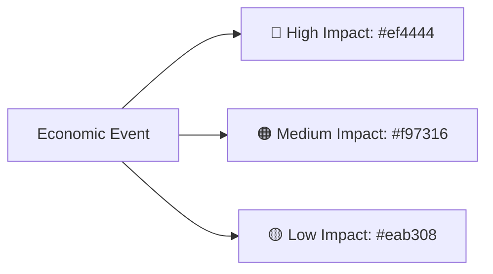

# Market Sync — Complete Design System & Architecture Specification

**Project**: Market Sync (`market-sync`)  
**Current Version**: `v1.5.0` (Design Language `v2.1` Command-Center)  
**Developer**: **Mahabub H. Aabir** (`maha_bub@outlook.com`)  
**Official Repository**: [https://github.com/mahabubaabir/market-sync](https://github.com/mahabubaabir/market-sync)  
**Target Environments**: Linux Mint 21/22+ (Cinnamon 5.x/6.x), Ubuntu 22.04/24.04+ (Cinnamon/GNOME/XFCE)  
**License**: MIT  

---

## 1. Executive Summary & Design Philosophy

**Market Sync** is a desktop trading companion designed to bring the elegance of macOS menu-bar trading countdowns to Linux desktops.

### Core Visual Principles
1. **Material UI Frosted Glass (Glassmorphism)**: Translucent, frosted background surfaces (`rgba(...)`) that harmoniously blend with the user’s personal desktop wallpaper.
2. **Calm Active Highlights (v2.1)**: Open sessions use one fixed design-system green everywhere — `#30d158` on dark themes, `#16a34a` on light themes — independent of the app theme. Softened theme accents (`#3ecf8e`-family) support it without shouting.
3. **Muted Off-State Legibility**: Closed or off-session hubs use crisp, readable silvery-white slate instead of overly dark or illegible tones.
4. **Pills stay pills**: Qt paints opaque QSS backgrounds square, ignoring `border-radius`. Every capsule label therefore sets `WA_TranslucentBackground` (see `pill_label()`), which forces the rounded path without changing colors.
4. **Minimal Panel Footprint**: Saves over 60% of top bar horizontal space by using 3-letter symbols (`LON`, `NYC`, `SYD`, `TYO`), tight formatting (`+04:05`), and smart session filters (`Active + Next`).
5. **All-in-One Unified Top Panel Integration**: The Cinnamon applet is a **text-only** widget (`Applet.TextApplet`, no icon actor) showing the **Live Countdown** with **Left-Click to Open Panel** and **Right-Click for App Menu**. The twin-arrow logo lives on the app window, panel brand bar, and standalone tray icon (both-in-one).

---

## 2. Color Palette & Design Tokens

### 2.1 Dark Glass Theme (Default)

| Token Name | Hex / RGBA | Usage |
| :--- | :--- | :--- |
| `--window-bg` | `rgba(16, 20, 30, 0.88)` | Main dropdown container background |
| `--window-border` | `1px solid rgba(255, 255, 255, 0.08)` | Outer window glass border |
| `--card-bg-default` | `rgba(28, 34, 48, 0.70)` | Inactive/closed market card background |
| `--card-bg-active` | `rgba(20, 42, 30, 0.65)` | Active open market card background |
| `--card-border-default` | `1px solid rgba(255, 255, 255, 0.06)` | Inactive card border |
| `--card-border-active` | `1.5px solid #30d158` | Active open market illuminated border |
| `--card-border-hover` | `1px solid rgba(255, 255, 255, 0.16)` | Card mouse hover outline |
| `--text-primary` | `#f1f5f9` (Slate 100) | Main titles, numbers, large countdowns |
| `--text-secondary` | `#94a3b8` (Slate 400) | Subtitles, local clocks, labels |
| `--text-muted` | `#64748b` (Slate 500) | Secondary hints and disabled elements |
| `--accent-green` | `#30d158` | Open market status, active dot, progress arc |
| `--accent-cyan` | `#38bdf8` | Brand accent, filter highlight, link hover |
| `--panel-closed-text` | `#cbd5e1` | Closed sessions in top bar (crisp slate) |
| `--divider` | `rgba(255, 255, 255, 0.08)` | Section dividing lines |

### 2.2 Light Glass Theme

| Token Name | Hex / RGBA | Usage |
| :--- | :--- | :--- |
| `--window-bg-light` | `rgba(250, 252, 255, 0.88)` | Light mode window background |
| `--window-border-light`| `1px solid rgba(0, 0, 0, 0.08)` | Light mode outer glass border |
| `--card-bg-light` | `rgba(255, 255, 255, 0.85)` | Inactive market card background |
| `--card-active-light` | `rgba(236, 253, 245, 0.90)` | Active open market card background |
| `--card-border-active`| `1.5px solid #16a34a` | Emerald active card border |
| `--text-primary-light` | `#0f172a` (Slate 900) | High-contrast dark typography |
| `--text-sec-light` | `#475569` (Slate 600) | Secondary light mode typography |

---

## 3. Economic News Multi-Impact Engine

Economic news events are categorized into 3 standardized impact levels, each styled with dedicated semi-transparent backgrounds and borders for instant scannability:


```mermaid
graph LR
    A[Economic Event] --> B[🔴 High Impact: #ef4444]
    A --> C[🟠 Medium Impact: #f97316]
    A --> D[🟡 Low Impact: #eab308]
```

### Impact Color Specifications

| Impact Level | Accent Hex | Dark Mode Background | Dark Mode Border | Pill Text |
| :--- | :---: | :--- | :--- | :---: |
| 🔴 **High** | `#ef4444` | `rgba(239, 68, 68, 0.18)` | `1px solid rgba(239, 68, 68, 0.40)` | `HIGH` |
| 🟠 **Medium** | `#f97316` | `rgba(249, 115, 22, 0.18)` | `1px solid rgba(249, 115, 22, 0.40)` | `MED` |
| 🟡 **Low** | `#eab308` | `rgba(234, 179, 8, 0.18)` | `1px solid rgba(234, 179, 8, 0.40)` | `LOW` |

### Interactive Multi-Select Filter Chips
In the "Up Next" news drawer header, users can toggle any combination of impact chips:
- `[All]`: Toggles all levels simultaneously.
- `[🔴 High]`: Shows/hides High Impact market-moving announcements.
- `[🟠 Med]`: Shows/hides Medium Impact reports.
- `[🟡 Low]`: Shows/hides Low Impact economic releases.

---

## 4. Landmark Vector Badges

Each financial hub is represented by a dedicated vector landmark icon rendered inside a circular badge with that hub's signature color glow:

```
┌─────────────┬─────────────┐
│  🎡 London  │  🗽 New York │
│  +04:05     │  -00:35     │
├─────────────┼─────────────┤
│  ⛵ Sydney  │  ⛩️  Tokyo   │
│  -57:35     │  -60:35     │
└─────────────┴─────────────┘
```

1. 🇬🇧 **London (LON)**: **London Eye** (`assets/london.svg`)
   - *Design*: Elegant rotating Ferris wheel rim, observation passenger pods, and radial suspension spokes. Accent: `#8ecd76`.
2. 🇺🇸 **New York (NYC)**: **Statue of Liberty** (`assets/new_york.svg`)
   - *Design*: Ascending beacon torch flame, crown rays, and stylized draped pedestal robe. Accent: `#c792ea`.
3. 🇦🇺 **Sydney (SYD)**: **Sydney Opera House** (`assets/sydney.svg`)
   - *Design*: Iconic expressionist interlocking shell roofs soaring over water waves. Accent: `#4da3ff`.
4. 🇯🇵 **Tokyo (TYO)**: **Torii Gate** (`assets/tokyo.svg`)
   - *Design*: Sacred Shinto gateway with curved kasagi top lintel, nuki tie-beam, and dual round pillars. Accent: `#ff6b6b`.

---

## 5. Brand Identity & Minimal Logo

The official Market Sync emblem represents global financial liquidity and time synchronicity.

```
      ╭───────╮        Two folded arrows, 180 degrees apart, chasing each
    ╭─╯       ╰─╮      other round the ring. Tuned for 16px legibility.
    │           │
   ◄─           ─►    Upper arrow: Cyan -> Indigo (#67e8f9 -> #818cf8)
    │           │     Lower arrow: Emerald -> Sky (#6ee7b7 -> #38bdf8)
    ╰─╮       ╭─╯
      ╰───────╯
```

### Bold variant (v1.4.3)

The pre-1.4.3 mark used two thin arcs (17 units) whose separate triangular
heads antialiased into mush at 16px. The current mark is rebuilt for tray size:

- **Band thickness 28 units** (`R=47, r=19`) — ~4.5px of solid stroke at 16px.
- **Blunt heads**: the tip is a flat radial edge 12 units wide. A sharp point
  loses >90% of its pixels to antialiasing at 16px, so the mass is preserved.
- **42° gaps** between the arrows so both stay readable as two distinct shapes
  (verified: exactly two connected blobs at every rendered size).
- **Soft keyline** (`#0b1220` @ 22%, width 3) so the mark survives light panels
  as well as dark ones.

Measured at 16px vs the v1.4.2 mark: solid pixel coverage 27.3% → 35.2%,
antialias halo 18.0% → 14.8%, contrast vs a dark panel +37%, vs a light
panel +14%.

### SVG Path Structure (`assets/icon.svg`, `assets/logo.svg`)
- **Canvas**: transparent `100x100` — no squircle/clock container (removed in v1.4.2).
- **Upper Arrow**: `M 28.66 8.12 A 47 47 0 0 0 19.17 85.47 L 36.02 86.41 L 40.32 75.21 L 37.53 64.34 A 19 19 0 0 1 45.08 31.65 Z` (gradient `arrowA`: `#67e8f9` → `#818cf8`)
- **Lower Arrow**: `M 71.34 91.88 A 47 47 0 0 0 80.83 14.53 L 63.98 13.59 L 59.68 24.79 L 62.47 35.66 A 19 19 0 0 1 54.92 68.35 Z` (gradient `arrowB`: `#6ee7b7` → `#38bdf8`)
- **Gradients use `gradientUnits="userSpaceOnUse"`** so the head and band share one continuous ramp (no seam where they meet).
- **`assets/logo.svg` only**: adds the illuminated convergence core (white `r=6.5` with cyan pupil `r=3.5`) plus a Gaussian glow — for docs/README at large sizes. `assets/icon.svg` omits it so the tray silhouette stays clean.
- **Packaging**: `tools/render_icons.py` renders `assets/icon.svg` into all hicolor PNG sizes; `cinnamon-applet/*/icon.png` (128px catalog art) is generated from the same source.

---

## 6. Top Panel Applet Specification (`market-sync@cinnamon`)

The native Cinnamon panel integration resides in `~/.local/share/cinnamon/applets/market-sync@cinnamon/`.

### 6.1 Pango Markup Formatting
```html
<span weight="bold" foreground="#30d158">● LON +04:05</span>  <span foreground="#cbd5e1">○ NYC -00:35</span>
```
- **Active Open Market**: Prefixed with filled circle `●`, rendered in the **fixed spec green** — `#30d158` on dark panels, `#16a34a` on light panels (`spec_green()`, independent of the app theme).
- **Closed Market**: Prefixed with open ring `○`, rendered in **crisp silvery-white slate** (`#cbd5e1`).

### 6.2 Space-Saving Session Modes
Users can select their preferred horizontal footprint in **Preferences > Panel Sessions**:

| Mode | Visual Format | Characters | Space Saved |
| :--- | :--- | :---: | :---: |
| **`Active Only`** | `● LON +04:05` | 13 chars | **78% saved** |
| **`Active + Next` (Default)** | `● LON +04:05  ○ NYC -00:35` | 26 chars | **57% saved** |
| **`All`** | `● LON +04:05  ○ NYC -00:35  ○ SYD -57:35  ○ TYO -60:35` | 55 chars | Baseline |

### 6.3 All-In-One Unified Behavior
- **Text-only applet**: `applet.js` extends `Applet.TextApplet` — there is no icon actor, so the top bar shows sessions only (e.g. `● LON +04:05  ○ NYC -00:35`). The twin-arrow `icon.png` / `icon.svg` beside it exist only for the Applets-manager catalog list.
- **Left-Click**: Invokes `market-sync --toggle` to raise or dismiss the Glass UI dropdown.
- **Right-Click**: Displays the native Cinnamon context menu with:
  - *Toggle Panel*
  - *Preferences...*
  - *Quit Market Sync*
- **Both-in-one tray**: the standalone Qt `QSystemTrayIcon` stays visible while the applet runs (`show_standalone_tray: true` by default; Preferences can uncheck it for applet-only). Tray styles via `tray_icon_style` in settings:
  - `logo` (recommended): compact 24px twin-arrow mark + green/grey status dot — always legible in Cinnamon's tray.
  - `text`: wide rendered session strip (`○ SYD -39:19`); Cinnamon's tray can squeeze wide pixmaps into a blank-looking slot, so prefer `logo` when both applet and tray are shown.

---

## 7. Engine Calculations & Formulas

### 7.1 Signed Countdown Formula
- **When Open (`is_open == True`)**:
  Counts down to market close time, prefixed with `+`:
  $$\text{Sign} = \text{"+"}, \quad \text{Time} = \text{CloseTime} - \text{CurrentLocalTime}$$
  *Example*: `+04:05` (Market remains open for 4 hours and 5 minutes).
- **When Closed (`is_open == False`)**:
  Counts down to next market open time, prefixed with `-`:
  $$\text{Sign} = \text{"-"}, \quad \text{Time} = \text{NextOpenTime} - \text{CurrentLocalTime}$$
  *Example*: `-00:35` (Market opens in 35 minutes).

### 7.2 Mini Circular Progress Ring Timer Arc
The mini circular ring timer inside each market card visually indicates elapsed progress of the session:
$$\text{Progress} = \frac{\text{Now} - \text{SessionStart}}{\text{SessionEnd} - \text{SessionStart}}, \quad \text{Angle} = \text{Progress} \times 360^\circ$$
- **Open Session**: Arc stroke `#30d158` (Neon Green).
- **Closed Session**: Muted background ring stroke `rgba(255, 255, 255, 0.12)`.

---

## 8. File Structure & Architecture Map

```
market-sync/
├── assets/                       # Vector SVGs and app branding
│   ├── logo.svg                  # Minimal Market Sync twin-arc logo
│   ├── icon.svg                  # Transparent twin-arrow app icon (window, brand bar, tray, hicolor)
│   ├── london.svg                # London Eye landmark
│   ├── new_york.svg              # Statue of Liberty landmark
│   ├── sydney.svg                # Sydney Opera House landmark
│   └── tokyo.svg                 # Torii Gate landmark
├── cinnamon-applet/              # Native Cinnamon top panel applet
│   └── market-sync@cinnamon/
│       ├── applet.js             # TextApplet text-only engine & Pango renderer
│       ├── metadata.json         # Cinnamon applet manifest
│       ├── icon.png              # 128x128 Applets-manager catalog icon (twin-arrow)
│       └── icon.svg              # Vector catalog icon (twin-arrow)
├── autostart/                    # Desktop autostart manifest
│   └── market-sync.desktop
├── config.py                     # Central configuration, defaults, paths
├── markets.py                    # DST timezone engine & holiday calendar
├── calendar_api.py               # ForexFactory economic news caching engine
├── ui.py                         # PyQt6 Material Glass UI & Tray controller
├── main.py                       # CLI & GUI launcher and IPC daemon
├── install.sh                    # 1-step terminal installer
├── install-applet.sh             # 1-step Cinnamon applet restorer
├── run.sh                        # Terminal-detached background runner
├── build-deb.sh                  # Debian package (.deb) builder
├── requirements.txt              # Python dependencies
├── README.md                     # User documentation
├── DESIGN_SYSTEM.json            # Machine-readable JSON style & design spec
└── DESIGN_SYSTEM.md              # Human-readable markdown specification (this file)
```

---

## 9. Quick Commands Reference

```bash
# 1. Install or update application
./install.sh

# 2. Restore Cinnamon top panel applet
./install-applet.sh

# 3. Launch in background (safe to close terminal)
./run.sh

# 4. Toggle dropdown window from terminal or shortcuts
market-sync --toggle

# 5. Open preferences directly
market-sync --preferences

# 6. Terminal ASCII trading clock with economic news
python3 main.py --cli --news
```

## 10. Command-Center Layout (v1.5.0)

The dropdown is a 470px command center, top to bottom:

1. **Summary card** — `N MARKETS OPEN` (spec-green count + open symbols) · divider · `NEXT EVENT` (currency + title + countdown, fed by the off-day fallback so it works on weekends).
2. **SESSION FLOW strip** — five session chips (`● LON` spec-green when open, `○ NYC` silver when closed) + local clock.
3. **Market cards** — 2-column, 104px, radius 14: 32px landmark badge, name + market-local time, 25px signed countdown, `OPEN`/`CLOSED` pill (`pill_label()`), 28px progress ring (spec-green arc).
4. **Brand bar** — logo, MARKET SYNC, drawer toggle, alerts bell, preferences, hide.
5. **Up Next drawer** — 34px rows (relative countdown • impact pill • theme-aware currency pill • title); impact chips and pills share `IMPACT_STYLE` via `impact_variant()`; empty states distinguish weekend-gap / filtered-out / fetching.

### Settings (post-cull)

Twenty keys, every one wired to UI. Removed in v1.5.0: `time_mode`, `min_impact` (migration read kept), `show_symbol`, `show_countdown`, `show_local_time`, `show_next_event` (single-mode tray is fixed `SYM +COUNTDOWN`). Exposed in Preferences: alert timing (5/10/15/30 min) and left-click action.

### Eye-soothing tokens (v2.1)

Deepened backgrounds (`rgba(13,17,25,.92)` dark), softened accents (green `#3ecf8e`-family, cyan `#5bb8dd`), hairline borders (4–6% alpha), warm off-white light surfaces. Contrast floor: body text ≥ 4.5:1, captions/accents ≥ 3:1 on every theme (machine-audited). Panel carries a soft drop shadow; opening fades in over 150ms; `Esc` hides it.
