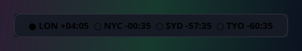
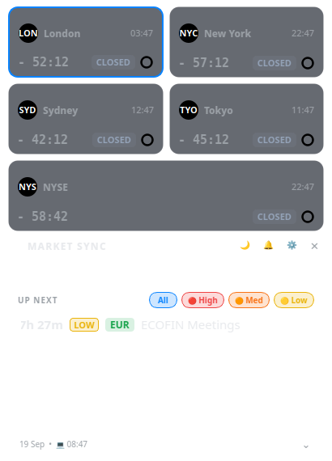
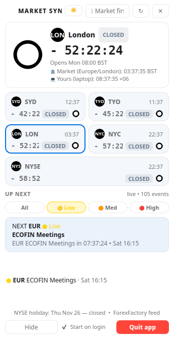
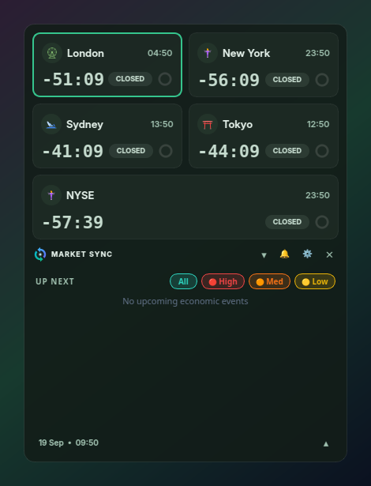
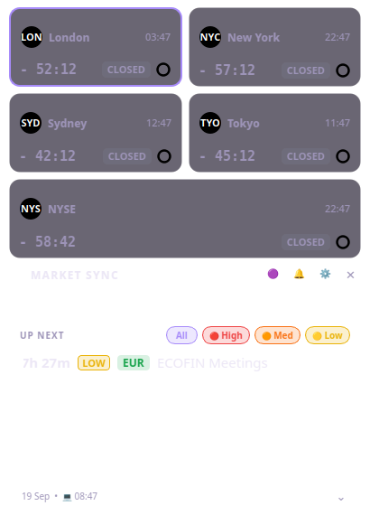
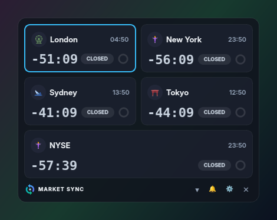
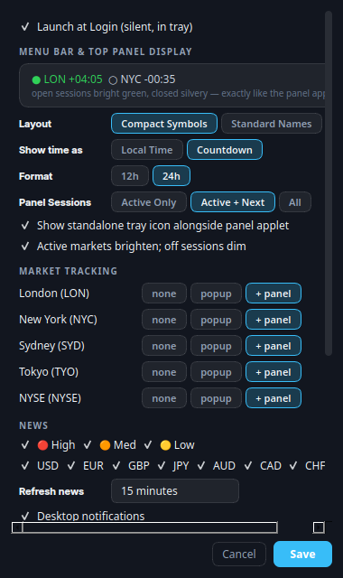

# ◉ Market Sync

Free, open-source **market countdown + economic news** for the Linux desktop —
Cinnamon top-panel applet + frosted-glass dropdown, bringing the elegance of
macOS menu-bar trading countdowns to Linux.

  

Live 1-second countdown in your top bar (`● LON +04:05  ○ NYC -00:35`), and a
click away: the glass panel with all sessions, landmark cards, and the Up Next
economic calendar.

## Install (one command)

Latest release: **v1.4.2** — older `.deb` releases were pruned, so always
install the newest asset from the
[Releases page](https://github.com/mahabubaabir/market-sync/releases).

```bash
curl -sL https://raw.githubusercontent.com/mahabubaabir/market-sync/main/install.sh | sudo bash
```

Then put it on your Cinnamon panel (both-in-one: text-only applet **and**
twin-arrow tray icon):

```bash
cd /opt/market-sync && ./install-applet.sh
```

- **Launch:** `market-sync` (or Super → "Market Sync")
- **Top panel applet (text-only):** `● LON +04:05  ○ NYC -00:35` — bright
  green when open, silvery when closed. **Left-click opens the same panel
  as the tray icon.** Right-click: Toggle Panel / Preferences… / Quit
- **Standalone tray:** compact twin-arrow logo with a green/grey status dot
  (`tray_icon_style: logo` in settings is recommended — the wide `text`
  strip can render as a blank slot in Cinnamon's tray)
- **IPC:** `market-sync --toggle` · `--show` · `--hide` · `--preferences` · `--quit`
- **At login:** starts silently in the tray
- **Quit:** tray menu, panel ✕ … or Preferences → Quit app
- **Uninstall:** `sudo apt remove market-sync` · applet: `./install-applet.sh --remove`

<details>
<summary>Manual install / build from source</summary>

```bash
git clone https://github.com/mahabubaabir/market-sync
cd market-sync
./build-deb.sh                       # → dist/market-sync_<version>_all.deb
sudo apt install ./dist/market-sync_*_all.deb
./install-applet.sh                  # optional: Cinnamon top-panel applet
```

Dev run without installing:

```bash
sudo apt install python3-pyqt6 python3-pyqt6.qtsvg python3-requests libnotify-bin
./run.sh                # background, survives closing the terminal
python3 main.py --cli --news          # text mode, no Qt needed
```
</details>

## Screenshots

| Top panel applet | Glass panel (dark) | Light | Mint dark | Dark purple |
|---|---|---|---|---|
|  |  |  |  |  |

Collapsed (dark) and Preferences (Design System v2.0):

| Collapsed | Preferences |
|---|---|
|  |  |

## Features

| Feature | Notes |
|---|---|
| Cinnamon top-panel applet | Text-only live `● LON +04:05` sessions via `panel_status.json`, left-click → panel, right-click menu — **and** the standalone twin-arrow tray icon stays (both-in-one) |
| Glass dropdown (v2.0) | 410px frosted panel, radius 14, translucent glass over any wallpaper |
| Landmark market cards | 2-column 82px cards: London Eye, Statue of Liberty, Sydney Opera House, Torii Gate badges; big signed countdowns; OPEN/CLOSED pills; progress rings |
| Neon active highlights | Open sessions glow `#30d158`; closed states stay readable silvery slate (toggleable) |
| Up Next drawer | Multi-select impact chips `[All] [🔴 High] [🟠 Med] [🟡 Low]`, relative times, impact + currency capsules, date bar |
| 5 markets, DST-correct | London, New York, Sydney, Tokyo, NYSE — IANA timezones, NYSE holidays + half-days computed locally |
| Economic calendar | ForexFactory feed, no API key, cached offline |
| IPC bridge | `market-sync --toggle/--show/--hide/--preferences/--quit` — applet and scripts drive the running panel |
| Alerts | Open/close pre-alert + high-impact news notifications; 🔔 toggle |
| 6 themes | System, Light, Dark, Dark Purple, Mint Light, Mint Dark |
| Preferences (380px) | Live top-panel preview, Layout / Show-time-as / Format / Panel Sessions segments, market routing table (none · popup · + panel), startup, updates |
| One-click updates | Daily GitHub release check → installs the new `.deb` with a password prompt |
| Crash-resilient | Auto-hide panel, single instance, restart-on-crash launcher, cached tray icon |

The full design specification lives in
[`DESIGN_SYSTEM.md`](DESIGN_SYSTEM.md) (tokens,
typography, components, applet + IPC specs).

## Tray interactions

```
Applet        left-click → same glass panel as the tray icon
              right-click → Toggle / Preferences… / Quit
Tray icon     left-click → panel (✕ hides), right-click → full menu
```

## Auto-updates (future updates)

Market Sync checks GitHub Releases once a day (and on demand via the
Preferences “Check now” button). When a newer version exists you get a
desktop notification, and the menu shows **⬆ Update to vX.Y.Z** — one click
downloads the `.deb` and installs it through a graphical password prompt,
then restarts.

Manual update path (same as fresh install):

```bash
curl -sL https://raw.githubusercontent.com/mahabubaabir/market-sync/main/install.sh | sudo bash
cd /opt/market-sync && ./install-applet.sh   # refresh the panel applet copy
```

Only the latest release is kept on GitHub, so updating always pulls the
newest `.deb` — no need to pick between old versions.

## Releasing (maintainer)

```bash
# bump APP_VERSION in config.py, then:
git add -A && git commit -m "release vX.Y.Z"
git tag vX.Y.Z && git push origin main --tags
```

GitHub Actions builds the `.deb` and attaches it to the release automatically.

## Settings & data

- `~/.config/market-sync/settings.json` — market, theme, filters, routing
- `~/.cache/market-sync/panel_status.json` — live applet payload (label/markup/tooltip)
- `~/.cache/market-sync/news_events.json` — news cache (15 min TTL)
- `~/.cache/market-sync/update.json` — update check cache (24 h)
- `~/.cache/market-sync/app.log` — launcher log (rotates at 1 MB)
- `~/.local/share/cinnamon/applets/market-sync@cinnamon/` — the top-panel applet

## Data & credit

- Session hours modelled on the macOS reference app (Sydney 21–06 UTC, Tokyo
  00–09 UTC, London 07–16 UTC, NY 12–21 UTC, NYSE 13:30–20 UTC) but stored as
  **market-local times** so DST is always right.
- News: `https://nfs.faireconomy.media/ff_calendar_thisweek.json`
  (ForexFactory/FairEconomy, free feed). Not affiliated. Always cross-check
  your broker before trading decisions.

## License

**MIT** — see [LICENSE](LICENSE).
